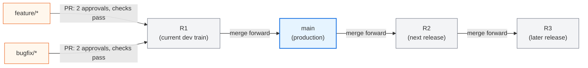

# Branch trains (Main + R1/R2/R3)

```mermaid
flowchart LR
  %% Main represents production.
  main["main<br/>(production)"]:::main

  %% Rolling release trains (3 active at any time)
  r1["R1<br/>(current dev train)"]:::train
  r2["R2<br/>(next release)"]:::train
  r3["R3<br/>(later release)"]:::train

  %% Typical change flow (forward merges)
  r1 -->|merge forward| main
  main -->|merge forward| r2
  r2 -->|merge forward| r3

  %% Feature branches are short-lived and merge into the active train (R1)
  f1["feature/*"]:::feature -->|PR: 2 approvals, checks pass| r1
  f2["bugfix/*"]:::feature -->|PR: 2 approvals, checks pass| r1

  classDef main fill:#e6f4ff,stroke:#1b74e4,stroke-width:2px;
  classDef train fill:#f3f4f6,stroke:#6b7280,stroke-width:1px;
  classDef feature fill:#fff7ed,stroke:#ea580c,stroke-width:1px;
```

**Why this scales:** forward-merging keeps future trains continuously caught up, reducing late-cycle conflict spikes.
