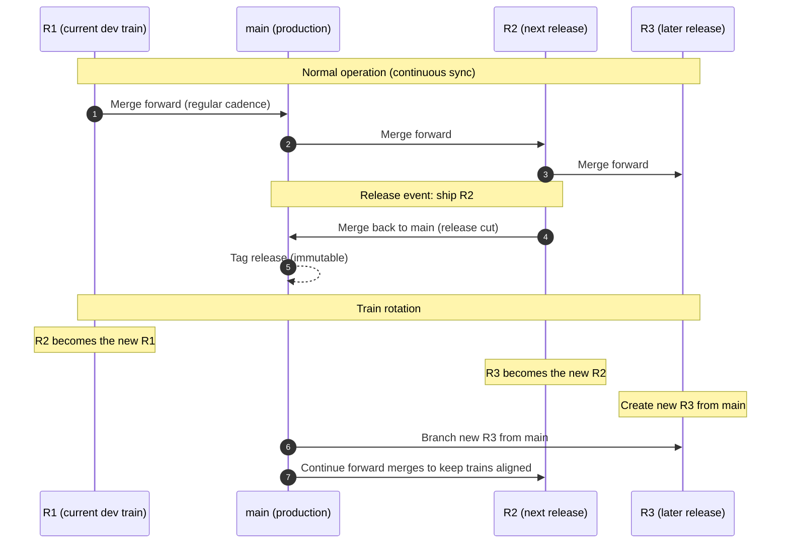

# Release rotation (when R2 ships)

```mermaid
sequenceDiagram
  autonumber
  participant R1 as R1 (current dev train)
  participant Main as main (production)
  participant R2 as R2 (next release)
  participant R3 as R3 (later release)

  Note over R1,R3: Normal operation (continuous sync)
  R1->>Main: Merge forward (regular cadence)
  Main->>R2: Merge forward
  R2->>R3: Merge forward

  Note over R2,Main: Release event: ship R2
  R2->>Main: Merge back to main (release cut)
  Main-->>Main: Tag release (immutable)

  Note over R1,R3: Train rotation
  Note over R1: R2 becomes the new R1
  Note over R2: R3 becomes the new R2
  Note over R3: Create new R3 from main
  Main->>R3: Branch new R3 from main
  Main->>R2: Continue forward merges to keep trains aligned
```

**Key idea:** only the “shipping train” merges back to `main` at release time; everything else is forward-only to avoid divergence.
