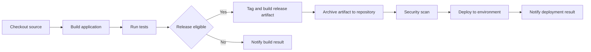

# CI pipeline stages (Build → Test → Tag/Build → Archive → Deploy → Notify)

**Notes**
- PRs validate quickly (Build/Test) and report status checks.
- Release branches run full packaging, archiving, scans, and promotion.
